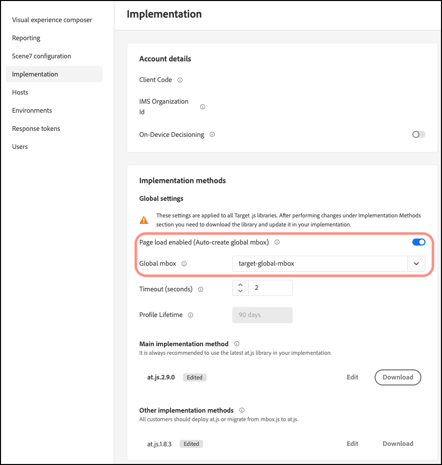

# Customize a global mbox

Information to help you customize an [!DNL Adobe Target] global mbox for at.js.

1. Click **[!UICONTROL Administration]** > **[!UICONTROL Implementation]**.

1. Disable **[!UICONTROL Page load enabled (Auto create global mbox)]**, then add the name of the custom global mbox that you would like to use to deliver activities from [!DNL Target].

>[!WARNING]
>
>The change is automatically saved when you select a different global mbox.

   This custom global mbox is also used for click tracking.

   

1. Implement the at.js library on your site.

   See [How to deploy at.js](/help/dev/implement/client-side/atjs/how-to-deployatjs/how-to-deployatjs.md) for more information.

1. Time the transition with your release.

   When you are ready for Tar[!DNL ]get to start using your global mbox for all activities in the future, you can proceed with this step.

   Update the name of the custom global mbox to match the name used in Step 2, above.

>[!WARNING]
>
>All activities in your account sync with this mbox. Ensure that the global mbox is present on your site so that activities continue functioning. Be sure to edit and re-save affected activities that were created with the [!UICONTROL Visual Experience Composer] (VEC) that sync with this mbox. It is not necessary to re-save activities created in the [!UICONTROL Form-Based Experience Composer] or via API.

