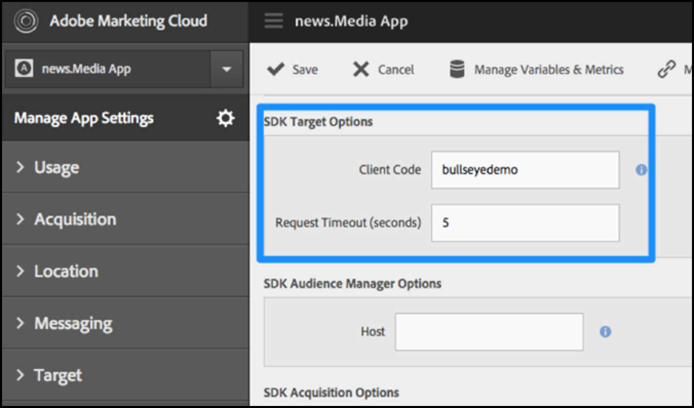
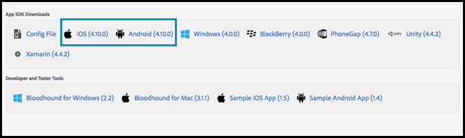

# Enable [!DNL Target] in the SDK

Add the [!UICONTROL Adobe Mobile Services SDK] to your app.

>[!IMPORTANT]
>
>Support for the [!DNL Adobe Mobile] version 4.*x* SDKs has ended as of August 31, 2021 and is no longer recommended for [!DNL Adobe Target] mobile users.
>
>The [Adobe Experience Platform SDK for Mobile Apps](https://developer.adobe.com/client-sdks/documentation/){target=_blank} is the recommended solution to power [!DNL Adobe Experience Cloud] solutions and services in your mobile apps.

1. If you haven't installed the Adobe Mobile Services SDK in your app, use your Analytics or Experience Cloud credentials and download the SDK from the [Adobe Mobile Services](https://mobilemarketing.adobe.com/) website.

1. Add the [!DNL Adobe Mobile Services SDK] to your app.

   You can find the instructions under [Core Implementation and Lifecycle](https://experienceleague.adobe.com/docs/mobile-services/ios/getting-started-ios/dev-qs.html). 

1. Add client code, timeout and enable SSL.

   In the Experience Cloud, open Mobile Services, then go to **[!UICONTROL Manage App Settings]** > **[!UICONTROL SDK Target Options]**.

   Add your [!DNL Target] clientcode and timeout. The clientcode is unique to your account or company. The timeout is the time in number of seconds until which [!DNL Target] will wait for a response before showing the default content. Make sure the **[!UICONTROL Use HTTPS]** option is checked in the Manage App Settings page in Adobe Mobile Services. If HTTPS isn't enabled, all calls in iOS9+ will be blocked unless you allowlist the [!DNL Target] server.

   

1. After you've created/located your app, find the app settings and download the desired SDK.

   

>[!WARNING]
>
> If you don't have access to the mobile marketing interface, you can make changes directly in the config file in your app code; however, it won't be in sync with the settings page in the user interface.
