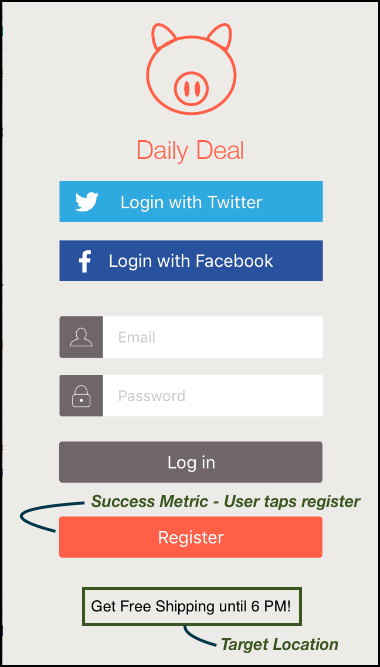
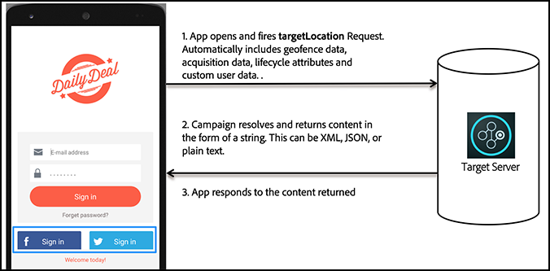

# How [!DNL Target] works in mobile apps

The [!DNL Adobe Mobile SDK] contacts the [!DNL Target] server to get the content along with other data points to show the right experience to the user.

>[!IMPORTANT]
>
>Support for the [!DNL Adobe Mobile] version 4.*x* SDKs has ended as of August 31, 2021 and is no longer recommended for [!DNL Adobe Target] mobile users.
>
>The [Adobe Experience Platform SDK for Mobile Apps](https://developer.adobe.com/client-sdks/documentation/){target=_blank} is the recommended solution to power [!DNL Adobe Experience Cloud] solutions and services in your mobile apps.

## [!DNL Target] locations and success metrics

A *target location* is also referred to as an mbox. An identified location in the app is enabled for testing or personalization (for example, the welcome message on the home screen). These locations are identified during the test creation process.

A *[success metric](https://experienceleague.adobe.com/docs/target/using/activities/success-metrics/success-metrics.html)* is an action performed by the user that identifies if a specific activity was successful (such as signing up, making a purchase, booking a ticket, and so on).

* **[!DNL Target] location:** The content that shows below the register button.

  This particular user is offered free shipping until 6 PM. This location can be reused across multiple [!DNL Target] activities to run A/B tests and personalization. 

* **Success metric:** The action performed by the user where the user taps the register button.

**Understand how [!DNL Target] works in the SDK**

