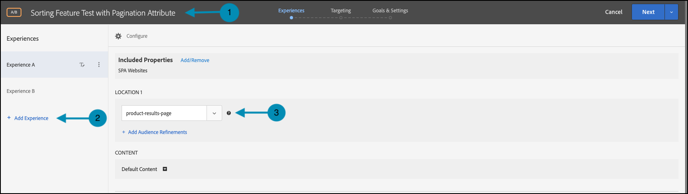
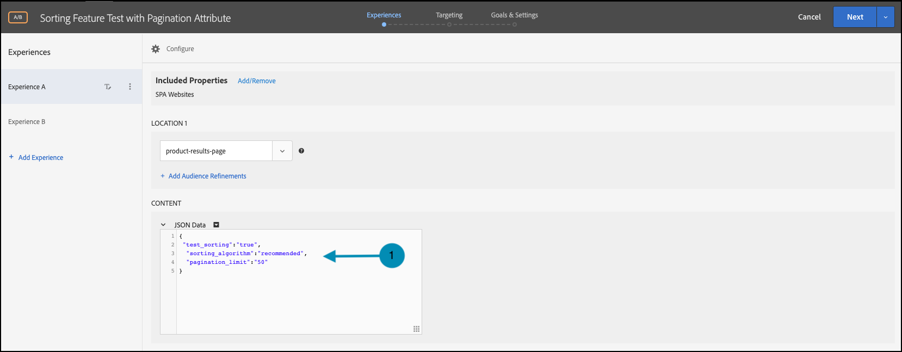
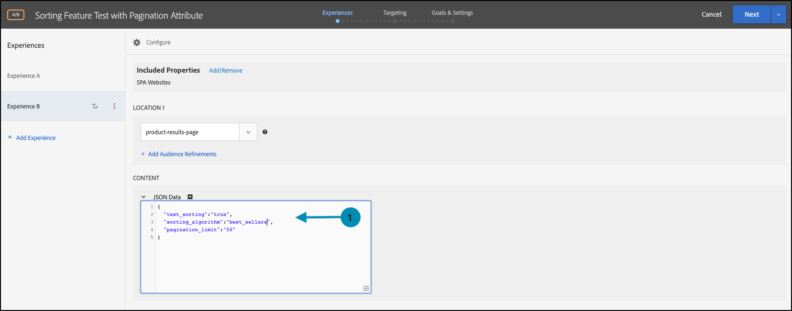
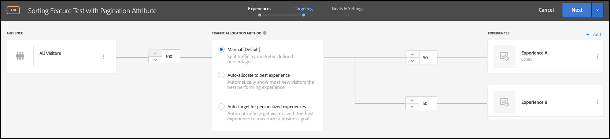
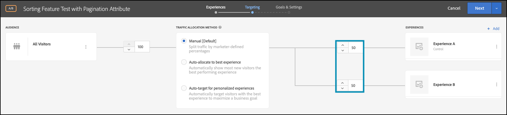
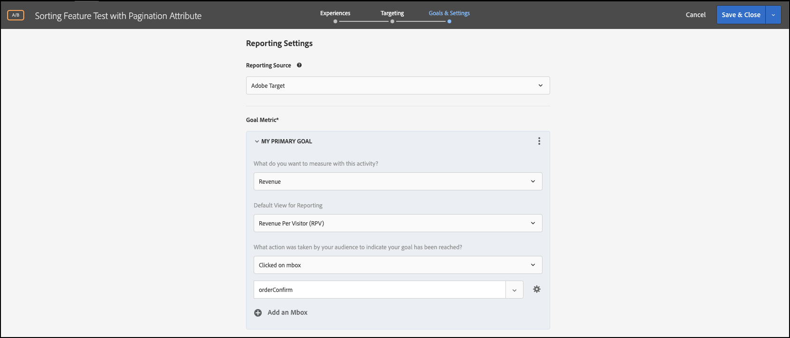
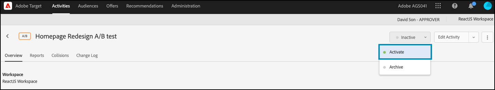

# Execute feature tests with attributes

## Summary of steps

1. Enable [!UICONTROL on-device decisioning] for your organization
1. Create an [!UICONTROL A/B Test] activity
1. Define your A and B
1. Add an audience
1. Set traffic allocation
1. Set traffic distribution to variations
1. Set up reporting
1. Add metrics for tracking KPIs
1. Implement code to execute feature tests with attributes
1. Implement code to track conversion events
1. Activate your feature tests with attributes

>[!NOTE]
>
>Suppose you are a retail e-commerce company. You want to increase the conversion rate when customers browse and sort through your catalog of products. You have a hypothesis that certain sorting algorithms and pagination strategies yield better results than others. To test this theory, you decide to run a feature test that involves the redesign of the sorting widget using different sorting options for your end users. You want to ensure this feature test is executed at near-zero latency so it doesn't negatively impact user experiences and skew the results.

## 1. Enable [!UICONTROL on-device decisioning] for your organization

Enabling on-device decisioning ensures an A/B activity is executed at near-zero latency. To enable this feature, navigate to **[!UICONTROL Administration]** > **[!UICONTROL Implementation]** > **[!UICONTROL Account details]** in [!DNL Adobe Target], and enable the **[!UICONTROL On-Device Decisioning]** toggle.


>[!NOTE]
>
>You must have the Admin or Approver [user role](https://experienceleague.adobe.com/docs/target/using/administer/manage-users/user-management.html) to enable or disable the **[!UICONTROL On-Device Decisioning]** toggle.

After enabling the **[!UICONTROL On-Device Decisioning]** toggle, [!DNL Adobe Target] begins generating *rule artifacts* for your client.

## 2. Create an [!UICONTROL A/B Test] activity

1. In [!DNL Adobe Target], navigate to the **[!UICONTROL Activities]** page, then select **[!UICONTROL Create Activity]** > **[!UICONTROL A/B test]**. 

   

1. In the **[!UICONTROL Create A/B Test Activity]** modal, leave the default **[!UICONTROL Web]** option selected (1), select **[!UICONTROL Form]** as your experience composer (2), select **[!UICONTROL Default Workspace]** with **[!UICONTROL No Property Restrictions]** (3), and click **[!UICONTROL Next]** (4).

   

## 3. Define your A and B

1. In the **[!UICONTROL Experiences]** step of activity creation, provide a name for your activity (1) and add a second experience, Experience B, by clicking the **[!UICONTROL Add Experience]** (2) button. Enter the name of the location (3) within your application where you want to execute your feature test with attributes. In the example shown below, `product-results-page` is the location defined for Experience A. (It is also the location defined for Experience B.)

   

   **[!UICONTROL Experience A]** will contain the JSON that signals your business logic to do the following:

   * Initiate the sorting algorithm feature via the `test_sorting` feature flag
   * Execute the recommended sorting algorithm defined in the `sorting_algorithm _**_attribute`
   * Return 50 products per page as defined by the pagination strategy defined in the `pagination_limit`

1. In Experience A, click to change the content from **[!UICONTROL Default Content]** to the JSON by selecting **[!UICONTROL Create JSON Offer]** as shown below (1).

   

1. Define the JSON with `test_sorting`, `sorting_algorithm`, and `pagination_limit` flags and attributes that will be used to initiate the recommended sorting algorithm with a pagination limit of 50 products.

   >[!NOTE]
   >
   >When [!DNL Adobe Target] buckets a user to see Experience A, the JSON with the defined attributes in the example will be returned. In your code, you will need to check the value of the feature flag `test_sorting` to see whether the sorting feature should be turned on. If so, you will use the recommended value of the `sorting_algorithm` attribute to show recommended products in the product list view. The limit of products to show for your application will be 50, since that is the value of the `pagination_limit` attribute.

   

   **[!UICONTROL Experience B]** will define the JSON that signals your business logic to do the following:

   * Initiate the sorting algorithm feature via the test_sorting feature flag
   * Execute the `best_sellers` sorting algorithm defined in the `sorting_algorithm _**_attribute`
   * Return 50 products per page as defined by the pagination strategy defined in the `pagination_limit`

   >[!NOTE]
   >
   >When [!DNL Adobe Target] buckets a user to see Experience B, the JSON with the defined attributes in the example will be returned. In your code, you will need to check the value of the feature flag `test_sorting` to see whether the sorting feature should be turned on. If so, you will use the `best_sellers` value of the `sorting_algorithm` attribute to show best selling products in the product list view. The limit of products to show for your application will be 50, since that is the value of the `pagination_limit` attribute.

   

## 4. Add an audience

In the **[!UICONTROL Targeting]** step, keep the **[!UICONTROL All Visitors]** audience. This will enable you to understand the impact of your sorting feature, as well as which algorithm and number of items best influence the results.



## 5. Set traffic allocation

Define the percentage of your visitors against which you want to test your sorting algorithms and pagination strategy. In other words, to what percentage of your users do you want to roll out this test? In this example, to deploy this test to all logged-in users, keep the traffic allocation at 100%.


## 6. Set traffic distribution to variations

Define the percentage of your visitors that will see the recommended versus the best sellers sorting algorithm, with a limit of 50 products per page. In this example, keep the traffic distribution as a 50/50 split between Experiences A and B.



## 7. Set up reporting

In the **[!UICONTROL Goals & Settings]** step, choose **[!UICONTROL Adobe Target]** as the **[!UICONTROL Reporting Source]** to view your A/B test results in the [!DNL Adobe Target] UI, or choose **[!UICONTROL Adobe Analytics]** to view them in the Adobe Analytics UI.



## 8. Add metrics for tracking KPIs

Choose a **[!UICONTROL Goal Metric]** to measure the feature test with attributes. In this example, success is based on whether the user purchases a product, depending on the sorting algorithm and pagination strategy they were shown.

## 9. Implement feature tests with attributes into your application

>[!BEGINTABS]

>[!TAB Node.js]

```js {line-numbers="true"}
const TargetClient = require("@adobe/target-nodejs-sdk");
const options = {
  client: "testClient",
  organizationId: "ABCDEF012345677890ABCDEF0@AdobeOrg",
  decisioningMethod: "on-device",
  events: {
    clientReady: targetClientReady
  }
};
const targetClient = TargetClient.create(options);

function targetClientReady() {
  return targetClient.getAttributes(["product-results-page"]).then(function(attributes) {
    const test_sorting = attributes.getValue("product-results-page", "test-sorting");
    const sorting_algorithm = attributes.getValue("product-results-page", "sorting_algorithm");
    const pagination_limit = attributes.getValue("product-results-page", "pagination_limit");
  });
}
```

>[!TAB Java]

```java {line-numbers="true"}
import com.adobe.target.edge.client.ClientConfig;
import com.adobe.target.edge.client.TargetClient;
import com.adobe.target.delivery.v1.model.ChannelType;
import com.adobe.target.delivery.v1.model.Context;
import com.adobe.target.delivery.v1.model.ExecuteRequest;
import com.adobe.target.delivery.v1.model.MboxRequest;
import com.adobe.target.edge.client.entities.TargetDeliveryRequest;
import com.adobe.target.edge.client.model.TargetDeliveryResponse;

ClientConfig config = ClientConfig.builder()
    .client("testClient")
    .organizationId("ABCDEF012345677890ABCDEF0@AdobeOrg")
    .build();
TargetClient targetClient = TargetClient.create(config);
MboxRequest mbox = new MboxRequest().name("product-results-page").index(0);
TargetDeliveryRequest request = TargetDeliveryRequest.builder()
    .context(new Context().channel(ChannelType.WEB))
    .execute(new ExecuteRequest().mboxes(Arrays.asList(mbox)))
    .build();
Attributes attributes = targetClient.getAttributes(request, "product-results-page");
String testSorting = attributes.getString("product-results-page", "test-sorting");
String sortingAlgorithm = attributes.getString("product-results-page", "sorting_algorithm");
String paginationLimit = attributes.getString("product-results-page", "pagination_limit");
```

>[!ENDTABS]

## 10. Implement code to track conversion events

>[!BEGINTABS]

>[!TAB Node.js]

```js {line-numbers="true"}
//... Code removed for brevity

//When a conversion happens
TargetClient.sendNotifications({
    targetCookie,
    "request" : {
      "notifications" : [
        {
          type: "click",
          timestamp : Date.now(),
          id: "conversion",
          mbox : {
            name : "product-results-page"
          }
        }
      ]
    }
})
```

>[!TAB Java]

```java {line-numbers="true"}
ClientConfig config = ClientConfig.builder()
  .client("acmeclient")
  .organizationId("1234567890@AdobeOrg")
  .build();
TargetClient targetClient = TargetClient.create(config);

Context context = new Context().channel(ChannelType.WEB);

ExecuteRequest executeRequest = new ExecuteRequest();

NotificationDeliveryService notificationDeliveryService = new NotificationDeliveryService();

Notification notification = new Notification();
notification.setId("conversion");
notification.setImpressionId(UUID.randomUUID().toString());
notification.setType(MetricType.CLICK);
notification.setTimestamp(System.currentTimeMillis());
notification.setTokens(
    Collections.singletonList(
        "IbG2Jz2xmHaqX7Ml/YRxRGqipfsIHvVzTQxHolz2IpSCnQ9Y9OaLL2gsdrWQTvE54PwSz67rmXWmSnkXpSSS2Q=="));

TargetDeliveryRequest targetDeliveryRequest =
    TargetDeliveryRequest.builder()
        .context(context)
        .execute(executeRequest)
        .notifications(Collections.singletonList(notification))
        .build();

TargetDeliveryResponse offers = targetClient.getOffers(request);
notificationDeliveryService.sendNotification(request);

Attributes attributes = targetClient.getAttributes(request, "product-results-page");
String testSorting = attributes.getString("product-results-page", "test-sorting");
String sortingAlgorithm = attributes.getString("product-results-page", "sorting_algorithm");
String paginationLimit = attributes.getString("product-results-page", "pagination_limit");
```

>[!ENDTABS]

## 11. Activate your feature tests with attributes


