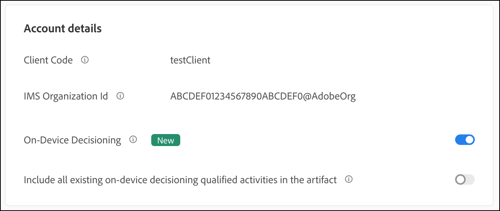
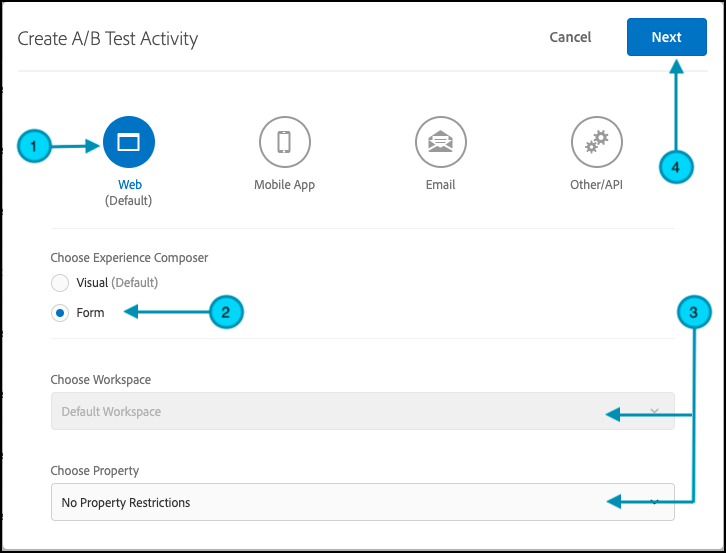
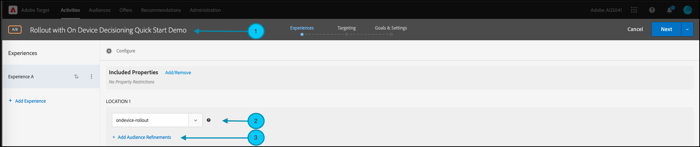
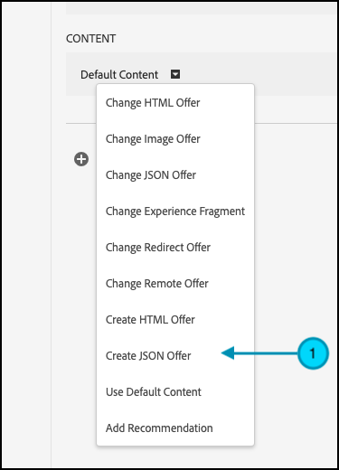
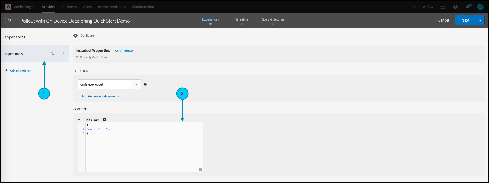
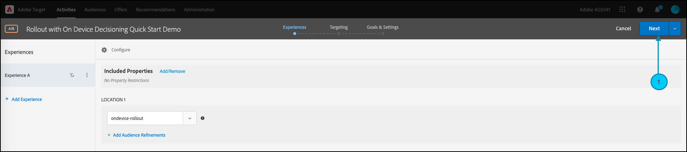
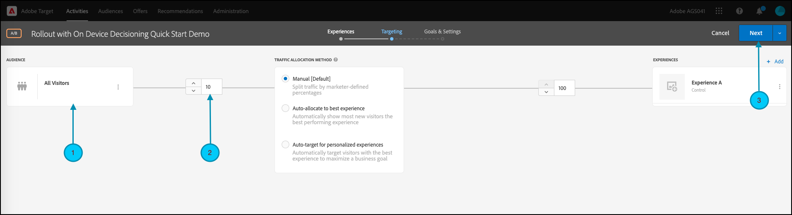
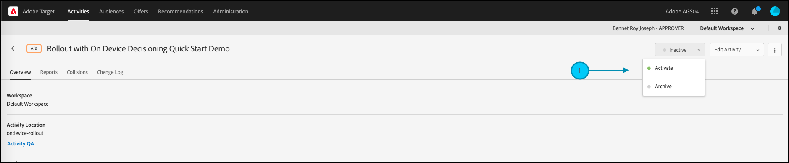
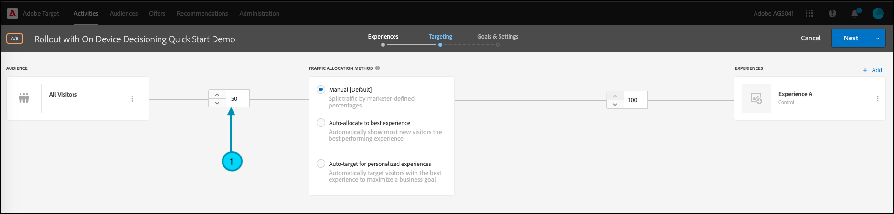

# Manage rollouts for feature tests

## Summary of steps

1. Enable [!UICONTROL on-device decisioning] for your organization
1. Create an [!UICONTROL A/B Test] activity
1. Define your feature and rollout settings
1. Implement and render the feature in your application
1. Implement tracking for events in your application
1. Activate your A/B activity
1. Adjust rollout and traffic allocation as needed

## 1. Enable [!UICONTROL on-device decisioning] for your organization

Enabling on-device decisioning ensures an A/B activity is executed at near-zero latency. To enable this feature, navigate to **[!UICONTROL Administration]** > **[!UICONTROL Implementation]** > **[!UICONTROL Account details]** in [!DNL Adobe Target], and enable the **[!UICONTROL On-Device Decisioning]** toggle.



>[!NOTE]
>
>You must have the Admin or Approver [user role](https://experienceleague.adobe.com/docs/target/using/administer/manage-users/user-management.html) to enable or disable the [!UICONTROL On-Device Decisioning] toggle.

After enabling the [!UICONTROL On-Device Decisioning] toggle, [!DNL Adobe Target] begins generating *rule artifacts* for your client.

## 2. Create an [!UICONTROL A/B Test] activity

1. In [!DNL Adobe Target], navigate to the **[!UICONTROL Activities]** page, then select **[!UICONTROL Create Activity]** > **[!UICONTROL A/B test]**.

   

1. In the **[!UICONTROL Create A/B Test Activity]** modal, leave the default **[!UICONTROL Web]** option selected (1), select **[!UICONTROL Form]** as your experience composer (2), select **[!UICONTROL Default Workspace]** with **[!UICONTROL No Property Restrictions]** (3), and click **[!UICONTROL Next]** (4).

   

## 3. Define your feature and rollout settings

In the **[!UICONTROL Experiences]** step of activity creation, provide a name for your activity (1). Enter the name of the location (2) within your application where you want to manage rollouts for your feature. For example,  `ondevice-rollout` or `homepage-addtocart-rollout` are location names indicating the destinations for managing feature rollouts. In the example shown below, `ondevice-rollout` is the location defined for Experience A. You can optionally add Audience refinements (4) to restrict qualification to the activity.



1. In the **[!UICONTROL Content]** section on the same page, select **[!UICONTROL Create JSON Offer]** in the drop-down (1) as shown.

   

1. In the **[!UICONTROL JSON Data]** text box that appears, enter the feature flag variable for the feature you intend to roll out with this activity in Experience A (1), using a valid JSON object (2).

   

1. Click **[!UICONTROL Next]** (1) to advance to the **[!UICONTROL Targeting]** step of activity creation.

   

1. In the **[!UICONTROL Targeting]** step, keep the **[!UICONTROL All Visitors]** audience (1), for simplicity. But adjust the traffic allocation (2) to 10%. This will restrict the feature to only 10% of your site visitors. Click Next (3) to advance to the **[!UICONTROL Goals & Settings]** step.

   

1. In the **[!UICONTROL Goals & Settings]** step, choose **[!UICONTROL Adobe Target]** (1) as the **[!UICONTROL Reporting Source]** to view your activity results in the [!DNL Adobe Target] UI.

1. Choose a **[!UICONTROL Goal Metric]** to measure the activity. In this example, a successful conversion is based on whether the user purchases an item, as indicated by whether the user reached the orderConfirm (2) location.

1. Click **[!UICONTROL Save & Close]** (3) to save the activity.

   

## 4. Implement and render the feature in your application

>[!BEGINTABS]

>[!TAB Node.js]

```
targetClient.getAttributes(["ondevice-rollout"]).then(function(attributes) {
      const featureFlags = attributes.asObject("ondevice-rollout");

      // Your flag variables are now available in the featureFlags object variable.
      //If you failed to qualify for the Activity, you will have an empty object.
      console.log(featureFlags);
    });
```

>[!TAB Java]

```
    Attributes attrs = targetJavaClient.getAttributes(targetDeliveryRequest, "ondevice-rollout");
    Map<String, Object> featureFlags = attrs.toMboxMap("ondevice-rollout");
​
    // Your flag variables are now available in the featureFlags object variable.
    //If you failed to qualify for the Activity, you will have an empty object.
    System.out.println(featureFlags);
```

>[!ENDTABS]

## 5. Implement tracking for events in your application

After making the feature flag variable available in the application, you can use it enable any feature that is already part of your application. If a visitor does not qualify for the activity, it means they were not included as part of the 10% bucket defined as the audience.

>[!BEGINTABS]

>[!TAB Node.js]

```
//... Code removed for brevity

if(featureFlags.enable == "yes") { //Fell within 10% traffic
    console.log("Render Feature");
}
else {
    console.log("Disable Feature");
}

// alternatively, the getValue method could be used on the Attributes object.

if(attributes.getValue("ondevice-rollout", "enable") === "yes") { //Fell within 10% traffic
    console.log("Render Feature");
}
else {
    console.log("Disable Feature");
}
```

>[!TAB Java]

```
//... Code removed for brevity
​
if("yes".equals(String.valueOf(featureFlags.get("enable")))) { //Fell within 10% traffic
    System.out.println("Render Feature");
}
else {
    System.out.println("Disable Feature");
}
​
// alternatively, the getString method could be used on the Attributes object.
​
if("yes".equals(attrs.getString("ondevice-rollout", "enable"))) { //Fell within 10% traffic
    System.out.println("Render Feature");
}
else {
    System.out.println("Disable Feature");
}
```

>[!ENDTABS]

## 6. Activate your rollout activity



## 7. Adjust rollout and traffic allocation as needed

Once you have activated your activity, edit it any time to increase or decrease the traffic allocation as needed.

Increasing the traffic allocation from 10% to 50% due to the success of the initial rollout.

