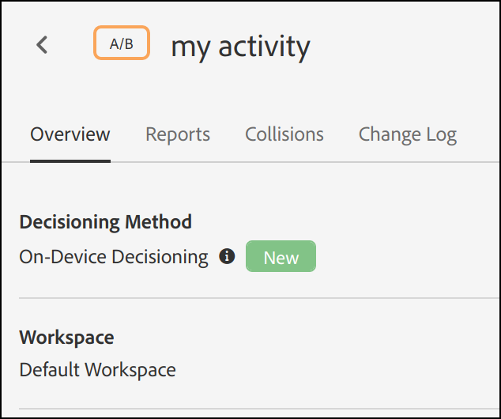
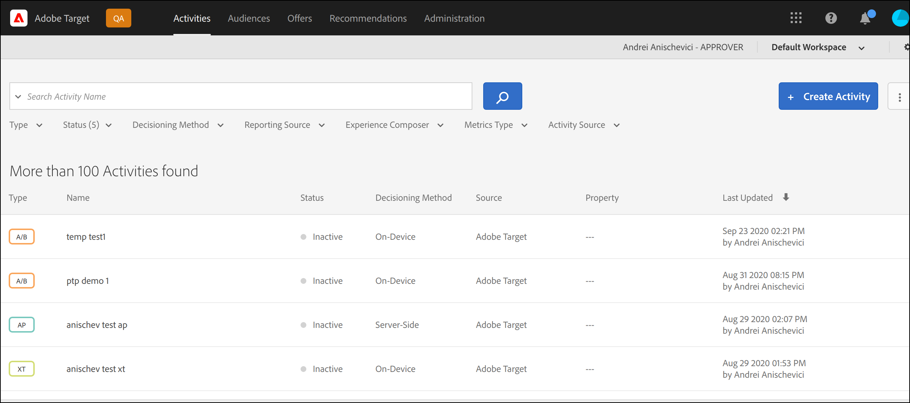

# On-device decisioning overview

The next-generation [!DNL Adobe Target] SDKs now offer [!UICONTROL on-device decisioning], which provides the ability to cache your A/B and Experience Targeting (XT) campaigns on your server and perform in-memory decisioning at near-zero latency, without blocking network requests to [!DNL Adobe Target]'s Edge Network.

[!DNL Adobe Target] also offers the flexibility of delivering the most relevant and up-to-date experience from your experimentation and ML-driven personalization campaigns via a live server call. In other words, when performance is most important, you can choose to utilize [!UICONTROL on-device decisioning], but when the most relevant and up-to-date experience is needed, a server call can be made instead. See [when to use on-device vs. edge decisioning](../../sdk-guides/on-device-decisioning/supported-features.md) to learn about use cases that warrant using one over the other.

>[!NOTE]
>
>On-device decisioning is available for both client-side as well as server-side implementations. This article describes [!UICONTROL on-device decisioning] for server-side. For information regarding [!UICONTROL on-device decisioning] for client-side, reference the client-side implementation documentation [here](../../../client-side/atjs/on-device-decisioning/on-device-decisioning.md).

## How does it work?

When you install and initialize an [!DNL Adobe Target] SDK with [!UICONTROL on-device decisioning] enabled, a *rule artifact* is downloaded and cached locally on your server, from the Akamai CDN closest to your server. When a request to retrieve an [!DNL Adobe Target] experience is made within your server-side application, the decision regarding which content to return is made in-memory, based on the metadata encoded in the cached rule artifact, which defines all of your [!UICONTROL on-device decisioning] A/B and XT activities.

The following diagram shows the [!UICONTROL on-device decisioning] architecture. Click to expand the image.

(Click image to expand to full width.)

{zoomable="yes"}

## What are the benefits?

* **Deliver near-zero latency decisions.** Bucketing and decisioning are performed in-memory and on-device to avoid blocking network requests.
* **Enhance application performance.** Run experiments and deliver personalization to your customers and users without compromising end-user experiences.
* **Improve Google Site Quality Score.** With decisioning happening in-memory and on the server-side, improve the Google Site Quality score of your online business to make it more discoverable by consumers.
* **Learn from real-time analytics.** Gain insights from your activity performance in real-time via [!DNL Adobe Target] or A4T reporting, enabling you to pivot your strategy at critical moments.

## Supported functionality

### Activities

On-device decisioning supports the following activity types created by the [Form-based Experience Composer](https://experienceleague.adobe.com/docs/target/using/experiences/form-experience-composer.html):

* [!UICONTROL A/B Test]
* [!UICONTROL Experience Targeting] (XT)

### Allocation Method

On-device decisioning supports the following allocation method:

* Manual

### Audience Targeting

On-device decisioning supports the following audience rules:

|Audience Rule|On-device Decisioning|
| --- | --- |
|[Geo](https://experienceleague.adobe.com/docs/target/using/audiences/create-audiences/categories-audiences/geo.html)|Yes|
|[Network](https://experienceleague.adobe.com/docs/target/using/audiences/create-audiences/categories-audiences/network.html)|No|
|[Mobile](https://experienceleague.adobe.com/docs/target/using/audiences/create-audiences/categories-audiences/mobile.html)|No|
|[Custom Parameters](https://experienceleague.adobe.com/docs/target/using/audiences/create-audiences/categories-audiences/custom-parameters.html)|Yes|
|[Operating System](https://experienceleague.adobe.com/docs/target/using/audiences/create-audiences/categories-audiences/operating-system.html)|Yes|
|[Site Pages](https://experienceleague.adobe.com/docs/target/using/audiences/create-audiences/categories-audiences/site-pages.html)|Yes|
|[Browser](https://experienceleague.adobe.com/docs/target/using/audiences/create-audiences/categories-audiences/browser.html)|Yes|
|[Visitor Profile](https://experienceleague.adobe.com/docs/target/using/audiences/create-audiences/categories-audiences/visitor-profile.html)|No|
|[Traffic Sources](https://experienceleague.adobe.com/docs/target/using/audiences/create-audiences/categories-audiences/traffic-sources.html)|No|
|[Time Frame](https://experienceleague.adobe.com/docs/target/using/audiences/create-audiences/categories-audiences/time-frame.html)|Yes|
|[Experience Cloud Audiences](https://experienceleague.adobe.com/docs/target/using/integrate/mmp.html) (Audiences from Adobe Audience Manager, Adobe Analytics, and Adobe Experience Manager|No|

## How do I provision my client to use [!UICONTROL on-device decisioning]?

On-device decisioning is available for all [!DNL Adobe Target] customers who use [!DNL Adobe Target] server-side SDKs. In order to enable this feature, navigate to **[!UICONTROL Administration]** > **[!UICONTROL Implementation]** > **[!UICONTROL Account details]** in the [!DNL Adobe Target] UI, and enable the **[!UICONTROL On-Device Decisioning]** toggle.

>[!NOTE]
>
>You must have the Admin or Approver *user role* to enable or disable the [!UICONTROL On-Device Decisioning] toggle.

After enabling the On-Device Decisioning toggle, [!DNL Adobe Target] will begin generating and propagating *rule artifacts* for your client.

>[!NOTE]
>
>Ensure you enable the toggle before you initialize the [!DNL Adobe Target] SDK to use [!UICONTROL on-device decisioning]. The rule artifacts will first need to generate and propagate to the Akamai CDNs in order for [!UICONTROL on-device decisioning] to work.

### Include all existing [!UICONTROL on-device decisioning] qualified activities in the artifact toggle

Toggle this **on** when you would like all your live [!DNL Target] activities that qualify for [!UICONTROL on-device decisioning] to be automatically included in the artifact.

Leaving this toggle **off** means you will need to re-create and activate any [!UICONTROL on-device decisioning] activities in order for them to be included in the generated rules artifact.

## How do I know an activity is [!UICONTROL on-device decisioning] capable?

After you create an activity, a label called **[!UICONTROL Decisioning Method]**, visible in the activity detail page, indicates whether the activity is [!UICONTROL on-device decisioning] capable.

You can also see all activities that are [!UICONTROL on-device decisioning] capable on the **[!UICONTROL Activities]** page by adding the column **[!UICONTROL Decisioning Method]** to the list of activities.

>[!NOTE]
>
>After creating and activating an activity that is [!UICONTROL on-device decisioning] capable, it may take up 5-10 minutes before it is included in the rules artifact that is generated and propagated to the Akamai CDN PoPs.

## What is the summary of steps I need to follow to ensure my [!UICONTROL on-device decisioning] activities are delivered successfully via [!DNL Adobe Target]'s server-side SDK?

1. Access the [!DNL Adobe Target] UI and navigate to **[!UICONTROL Administration]** > **[!UICONTROL Implementation]** > **[!UICONTROL Account details]** to enable the **[!UICONTROL On-Device Decisioning]** toggle.
1. Enable the **[!UICONTROL Include all existing [!UICONTROL on-device decisioning] qualified activities in the artifact]** toggle.
1. Create and activate an activity type that is supported by [!UICONTROL on-device decisioning], and verify that the **[!UICONTROL Decisioning Method]** is **[!UICONTROL On-Device Decisioning]** for that activity.
1. Install and initialize the [Node.js](../../node-js/overview.md) or [Java](../../java/overview.md) SDK with `decisioningMethod = on-device`.
1. Implement `getOffers()` or `getAttributes()` in your code to retrieve an experience on-device.
1. Deploy your code.

For examples demonstrating how to get started with steps 1-3 above, see the [Getting started](../getting-started/getting-started.md) section.

## Additional Resources

### Webinar: Personalize and test at zero latency with on-device decisions from [!DNL Adobe Target]

More than ever, marketers, product owners and developers are being tasked with optimizing the overall customer experience on sites, in apps, and everywhere else they connect with their customers. Multiple tools with data silos and complicated implementations are inadequate.

In this recorded webinar, [!DNL Adobe Target] product experts discuss how moving critical experience optimization decisions on-device to execute locally with near-zero latency can open doors to exciting new use cases while improving site performance for your customers.

>[!VIDEO](https://video.tv.adobe.com/v/328148/?quality=12)

### Tutorial: On-device decisioning

[!DNL Adobe Target] [!UICONTROL on-device decisioning] enables near-zero latency content delivery.

This 7-minute video:

* Describes [!UICONTROL on-device decisioning], including how it compares to other methods of [!DNL Target] implementation
* Demonstrates how to enable [!UICONTROL on-device decisioning] in Target
* Examines a sample form-based composer activity that has been configured with JSON content
* Shows sample Node.JS SDK code containing key configuration required for [!UICONTROL on-device decisioning]
* Demonstrates results in a browser

>[!VIDEO](https://video.tv.adobe.com/v/329032/?quality=12)

For more videos and tutorials, see the [[!DNL Adobe Target] Tutorials](https://experienceleague.adobe.com/docs/target-learn/tutorials/overview.html).

### Adobe Tech Blog - Part 1: Run [!DNL Adobe Target] NodeJS SDK for experimentation and personalization on edge platforms (Akamai Edge Workers)

[Click here to access the blog post](https://medium.com/adobetech/part-1-run-adobe-target-nodejs-sdk-for-experimentation-and-personalization-on-edge-platforms-4d8660964ed9).

### Adobe Tech Blog - Part 2: Run [!DNL Adobe Target] NodeJS SDK for experimentation and personalization on edge platforms (AWS Lambda@Edge)

[Click here to access the blog post](https://medium.com/adobetech/part-2-run-adobe-target-nodejs-sdk-for-experimentation-and-personalization-on-edge-platforms-aws-4d6bdac24563).
